# ESAI FAULT TOLERANCE DALAM SISTEM TERDISTRIBUSI

| | |
| --- | --- |
| **Nama** | Tanu Hasyim |
| **NIM** | 2488010011 |
| **Kelas** | Inf 5A |
| **Mata Kuliah** | Sistem Terdistribusi |
| **Dosen Pengampu** | Ir. Rizki Dewantara, S.Kom., M.Kom. |

---

## Daftar Isi

- [Pendahuluan](#pendahuluan)
- [1. Implementasi Sederhana Failure Detector dengan Heartbeat](#1-implementasi-sederhana-failure-detector-dengan-heartbeat)
- [2. Analisis Paper Practical Byzantine Fault Tolerance (PBFT) dan Summary](#2-analisis-paper-practical-byzantine-fault-tolerance-pbft-dan-summary)
- [3. Desain Checkpointing Strategy untuk Aplikasi Pilihan](#3-desain-checkpointing-strategy-untuk-aplikasi-pilihan)
- [4. Review Kasus Studi Sistem Fault Tolerant di Industri](#4-review-kasus-studi-sistem-fault-tolerant-di-industri)
- [Kesimpulan](#kesimpulan)
- [Daftar Pustaka](#daftar-pustaka)

---

## Pendahuluan

Dalam sistem terdistribusi, kegagalan komponen bukanlah kemungkinan, melainkan kepastian. Semakin banyak node, jaringan, dan layanan yang saling bergantung, semakin besar peluang sebagian di antaranya berhenti bekerja, melambat, kehilangan pesan, atau bahkan berperilaku menyimpang. *Fault tolerance* adalah kemampuan sistem untuk tetap memberikan layanan yang benar meskipun sebagian komponennya mengalami kegagalan. Tujuannya bukan hanya menghindari *downtime*, tetapi juga menjaga konsistensi data dan kualitas layanan.

Esai ini menjawab empat tugas pada materi *Fault Tolerance dalam Sistem Terdistribusi*: (1) implementasi sederhana *failure detector* dengan *heartbeat*, (2) analisis paper *Practical Byzantine Fault Tolerance* (PBFT) beserta ringkasannya, (3) desain *checkpointing strategy* untuk aplikasi pilihan, dan (4) *review* studi kasus sistem fault tolerant di industri. Setiap bagian dilengkapi demonstrasi dengan bahasa pemrograman Python, langkah-langkah yang dapat dicoba ulang, kode program, serta bukti tangkapan layar hasil eksekusi.

### Persiapan Lingkungan (berlaku untuk keempat demonstrasi)

- Pastikan Python 3 sudah terpasang. Buka terminal (atau Command Prompt) dan jalankan `python3 --version`. Pada Windows gunakan `python --version`.

- Buat folder kerja bernama `Sistem-Terdistribusi-Fault-Tolerance` lalu masuk ke folder tersebut.

- Simpan empat berkas program dengan nama `demo1_heartbeat.py`, `demo2_pbft.py`, `demo3_checkpoint.py`, dan `demo4_quorum.py`. Kode lengkap setiap berkas tercantum pada bagian masing-masing.

- Periksa isi folder dengan perintah `ls` (Windows: `dir`). Seluruh program hanya memakai pustaka standar Python sehingga tidak perlu menjalankan `pip install`.

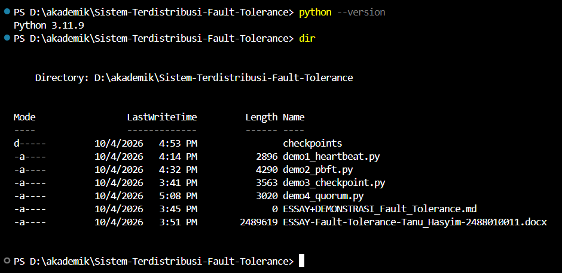

<p align="center"><em>Gambar 1. Versi Python dan isi folder kerja <code>demo_fault_tolerance</code>.</em></p>

## 1. Implementasi Sederhana Failure Detector dengan Heartbeat

### 1.1 Landasan Teori

*Failure detector* adalah mekanisme yang digunakan sebuah node untuk menduga apakah node lain masih hidup atau sudah gagal. Pendekatan paling sederhana adalah *heartbeat*: setiap node secara periodik mengirim sinyal “masih hidup” ke detector, dan bila sinyal tidak diterima dalam batas waktu (*timeout*) tertentu, node tersebut dianggap gagal. Pendekatan ini sederhana dan ber-*overhead* rendah, tetapi sulit menentukan nilai *timeout* yang optimal: *timeout* yang terlalu pendek menghasilkan *false positive* (node sehat dituduh gagal), sedangkan *timeout* yang terlalu panjang membuat kegagalan terdeteksi terlambat.

Kualitas sebuah failure detector dinilai dari dua properti, yaitu *completeness* (node yang benar-benar gagal pada akhirnya dicurigai) dan *accuracy* (node yang sehat tidak dicurigai secara keliru). Menurut Chandra dan Toueg (1996), *strong completeness* berarti setiap node yang gagal akhirnya dicurigai oleh semua node yang benar, sedangkan *weak completeness* cukup dicurigai oleh sebagian node yang benar. Pada slide materi, istilah *strong* dan *weak* untuk completeness tampak tertukar, sehingga esai ini mengikuti definisi pada literatur asli. Pada jaringan asinkron, node yang lambat tidak dapat dibedakan secara pasti dari node yang *crash*, sehingga *false positive* tidak dapat dihilangkan sepenuhnya; *timeout* hanyalah sebuah kompromi.

### 1.2 Rancangan Program

Program mensimulasikan tiga node (Node-1, Node-2, Node-3) yang masing-masing berjalan pada sebuah *thread* dan mengirim *heartbeat* setiap 1 detik. Detector memeriksa umur *heartbeat* terakhir setiap node tiap 1 detik (dengan selisih 0.5 detik agar tidak bertepatan dengan waktu kirim). Node berstatus ACTIVE bila umur *heartbeat* ≤ `TIMEOUT` (3 detik) dan FAILED bila lebih. Dua skenario disediakan:

- **normal**: ketiga node sehat selama 10 detik simulasi.

- **gagal**: Node-2 *crash* pada detik ke-4 (berhenti mengirim *heartbeat* selamanya), sedangkan Node-3 mengalami gangguan jaringan pada detik 1.5 s.d. 5.5 sehingga *heartbeat*-nya tertahan lalu pulih kembali.

### 1.3 Langkah-langkah Demonstrasi

- Buat berkas `demo1_heartbeat.py` di folder kerja, lalu salin kode pada bagian 1.4 (cuplikan berkas di editor ditunjukkan pada gambar berikut).

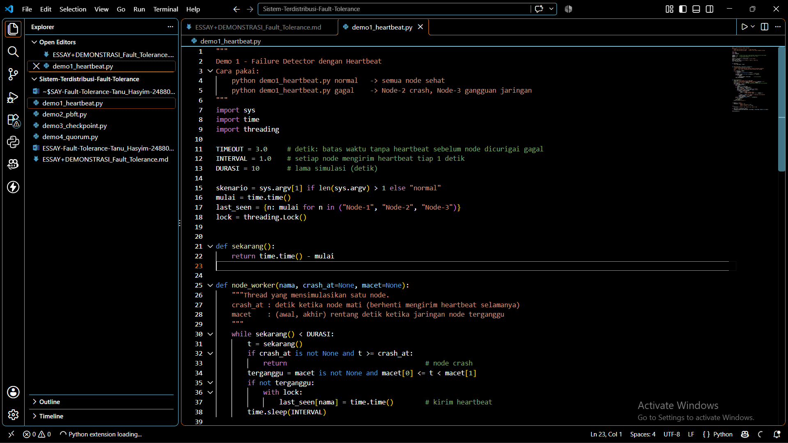

<p align="center"><em>Gambar 2. Cuplikan berkas <code>demo1_heartbeat.py</code> di editor.</em></p>

- Jalankan skenario normal dengan perintah `python demo1_heartbeat.py normal`, lalu tunggu sekitar 10 detik sampai muncul tulisan “Simulasi selesai”.

- Amati keluaran: pada setiap pemeriksaan ketiga node berstatus ACTIVE dengan umur *heartbeat* sekitar 0.5 detik.

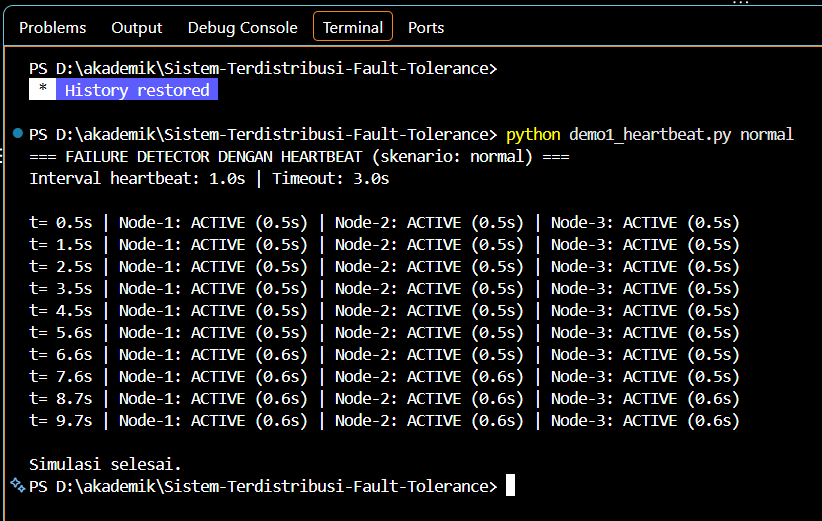

<p align="center"><em>Gambar 3. Keluaran skenario normal: seluruh node ACTIVE.</em></p>

- Jalankan skenario gagal dengan perintah `python demo1_heartbeat.py gagal`.

- Amati keluaran: perhatikan baris bertanda >> yang menunjukkan perubahan status node, serta kolom umur *heartbeat* yang terus membesar pada node yang bermasalah.

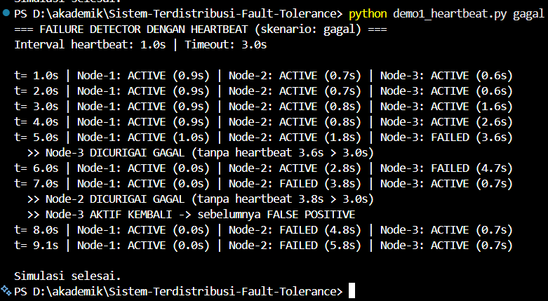

<p align="center"><em>Gambar 4. Keluaran skenario gagal: Node-3 false positive lalu pulih, Node-2 terdeteksi crash.</em></p>

- (Opsional) Ubah nilai `TIMEOUT` menjadi 1.5 atau 6, jalankan ulang skenario gagal, lalu bandingkan waktu deteksi *crash* dan jumlah *false positive*.

### 1.4 Kode Program

```python
"""
Demo 1 - Failure Detector dengan Heartbeat
Cara pakai:
    python demo1_heartbeat.py normal   -> semua node sehat
    python demo1_heartbeat.py gagal    -> Node-2 crash, Node-3 gangguan jaringan
"""

import sys
import time
import threading

TIMEOUT = 3.0     # detik: batas waktu tanpa heartbeat sebelum node dicurigai gagal
INTERVAL = 1.0    # setiap node mengirim heartbeat tiap 1 detik
DURASI = 10       # lama simulasi (detik)
skenario = sys.argv[1] if len(sys.argv) > 1 else "normal"
mulai = time.time()
last_seen = {n: mulai for n in ("Node-1", "Node-2", "Node-3")}
lock = threading.Lock()

def sekarang():
    return time.time() - mulai

def node_worker(nama, crash_at=None, macet=None):
    """Thread yang mensimulasikan satu node.
    crash_at : detik ketika node mati (berhenti mengirim heartbeat selamanya)
    macet    : (awal, akhir) rentang detik ketika jaringan node terganggu
    """
    while sekarang() < DURASI:
        t = sekarang()
        if crash_at is not None and t >= crash_at:
            return                                   # node crash
        terganggu = macet is not None and macet[0] <= t < macet[1]
        if not terganggu:
            with lock:
                last_seen[nama] = time.time()        # kirim heartbeat
        time.sleep(INTERVAL)

def failure_detector():
    status_lama = {n: "ACTIVE" for n in last_seen}
    print(f"=== FAILURE DETECTOR DENGAN HEARTBEAT (skenario: {skenario}) ===")
    print(f"Interval heartbeat: {INTERVAL}s | Timeout: {TIMEOUT}s\n")
    time.sleep(0.5)          # offset agar tidak bentrok dengan waktu kirim heartbeat
    while sekarang() < DURASI:
        baris, kejadian = [], []
        with lock:
            snapshot = dict(last_seen)
        for node, terakhir in snapshot.items():
            umur = time.time() - terakhir
            status = "ACTIVE" if umur <= TIMEOUT else "FAILED"
            baris.append(f"{node}: {status:<6} ({umur:3.1f}s)")
            if status != status_lama[node]:
                if status == "FAILED":
                    pesan = (f"{node} DICURIGAI GAGAL "
                             f"(tanpa heartbeat {umur:.1f}s > {TIMEOUT}s)")
                else:
                    pesan = f"{node} AKTIF KEMBALI -> sebelumnya FALSE POSITIVE"
                kejadian.append("  >> " + pesan)
                status_lama[node] = status
        print(f"t={sekarang():4.1f}s | " + " | ".join(baris))
        for k in kejadian:
            print(k)
        time.sleep(1.0)
    print("\nSimulasi selesai.")

if skenario == "gagal":
    konfigurasi = {"Node-1": {},
                   "Node-2": {"crash_at": 4.0},
                   "Node-3": {"macet": (1.5, 5.5)}}

else:
    konfigurasi = {"Node-1": {}, "Node-2": {}, "Node-3": {}}

for nama, opsi in konfigurasi.items():
    threading.Thread(target=node_worker, args=(nama,), kwargs=opsi, daemon=True).start()

failure_detector()
```

### 1.5 Hasil dan Analisis

Pada skenario normal, seluruh node tetap berstatus ACTIVE karena *heartbeat* selalu diterima sebelum *timeout*. Pada skenario gagal, urutan kejadian yang terekam pada keluaran adalah sebagai berikut.

| **Waktu** | **Kejadian pada detector** | **Penilaian** |
| --- | --- | --- |
| t=4.5s | Node-3 dicurigai gagal (umur *heartbeat* 3.5 s > 3.0 s) | *False positive*: node sebenarnya sehat, hanya jaringannya terganggu |
| t=6.5s | Node-2 dicurigai gagal (umur *heartbeat* 3.5 s > 3.0 s) | Deteksi benar: node *crash* pada t=4.0 s, terdeteksi sekitar 2.5 s kemudian |
| t=6.5s | Node-3 aktif kembali karena *heartbeat* diterima lagi | Kesalahan tuduhan terkoreksi otomatis |

Hasil tersebut memperlihatkan dua sifat penting. Pertama, detector bersifat *complete*: *crash* pada Node-2 pasti terdeteksi karena umur *heartbeat*-nya bertambah tanpa batas. Kedua, detector tidak *strongly accurate*: Node-3 sempat dituduh gagal padahal sehat. Ini sejalan dengan tantangan pada materi, yaitu sulitnya membedakan respons yang lambat dari kegagalan sungguhan, sehingga deteksi yang baik harus menyeimbangkan *responsiveness* dan *accuracy*.

Waktu deteksi ditentukan oleh `TIMEOUT` dan interval pemeriksaan: semakin kecil *timeout*, semakin cepat *crash* terdeteksi tetapi semakin sering *false positive* terjadi. Pada sistem nyata, kompromi ini diperbaiki dengan *timeout* adaptif seperti *φ accrual failure detector* (Hayashibara dkk., 2004) atau dengan pemeriksaan tidak langsung melalui node lain seperti pada protokol SWIM (Das dkk., 2002).

Keterbatasan implementasi ini adalah node disimulasikan dengan *thread* dalam satu proses, sehingga belum ada komunikasi jaringan, kehilangan paket, maupun jam yang tidak sinkron. Implementasi ini cukup untuk memperagakan prinsip dasar *heartbeat* dan *timeout*.

## 2. Analisis Paper Practical Byzantine Fault Tolerance (PBFT) dan Summary

### 2.1 Identitas Paper

Paper yang dianalisis adalah *Practical Byzantine Fault Tolerance* karya Miguel Castro dan Barbara Liskov (MIT Laboratory for Computer Science), dipublikasikan pada *Third Symposium on Operating Systems Design and Implementation* (OSDI ’99), New Orleans, Februari 1999.

### 2.2 Latar Belakang dan Masalah yang Dijawab

Kegagalan *Byzantine* adalah kegagalan paling berat karena node yang rusak dapat berperilaku sembarang: mengirim pesan salah atau bertentangan, bersekongkol, atau memberikan jawaban berbeda kepada node yang berbeda. Penyebabnya dapat berupa serangan berbahaya maupun *bug* perangkat lunak. Algoritma-algoritma sebelumnya hanya berjalan pada asumsi sistem sinkron, atau terlalu lambat untuk dipakai dalam praktik. Paper ini mengusulkan algoritma *state machine replication* yang mampu menoleransi kegagalan *Byzantine* pada lingkungan asinkron seperti Internet, dengan kinerja yang cukup baik untuk digunakan sungguhan, sehingga disebut “praktis”.

### 2.3 Model Sistem dan Asumsi

- Jaringan asinkron: pesan dapat tertunda, hilang, terduplikasi, atau tiba tidak berurutan.

- Terdapat n replica dan paling banyak f di antaranya *Byzantine*, dengan syarat **n ≥ 3f + 1**.

- Kegagalan antar-replica diasumsikan independen; penyerang tidak dapat memecahkan kriptografi (*digest*, MAC, dan tanda tangan digital).

- *Safety* (semua replica yang jujur menyepakati urutan yang sama) tidak bergantung pada sinkronisasi jaringan, sedangkan *liveness* (sistem terus membuat kemajuan) hanya terjamin bila jaringan pada akhirnya mengantar pesan dalam batas waktu yang wajar (*partial synchrony*).

Alasan syarat 3f+1: sistem tidak boleh menunggu lebih dari n − f jawaban karena f replica bisa saja tidak merespons. Dari n − f jawaban itu, sebanyak f bisa berasal dari replica *Byzantine*, sehingga yang jujur tinggal n − 2f. Jumlah ini harus lebih banyak daripada f agar suara jujur dapat mengalahkan suara palsu, yaitu n − 2f > f atau n > 3f.

### 2.4 Protokol Tiga Fase

Pada kondisi normal, satu replica bertindak sebagai *primary* dan sisanya *backup*. Alur penanganan satu permintaan client adalah sebagai berikut.

| **Fase** | **Aktivitas** | **Syarat melanjutkan** |
| --- | --- | --- |
| Request | Client mengirim permintaan ke *primary*. | - |
| Pre-prepare | *Primary* memberi nomor urut (*sequence number*) dan menyiarkan usulan ke seluruh *backup*. | *Backup* memeriksa keabsahan, *view*, dan nomor urut yang belum dipakai untuk *digest* lain. |
| Prepare | Setiap *backup* menyiarkan pesan PREPARE berisi *view*, nomor urut, dan *digest*. | Replica berstatus *prepared* bila memiliki pre-prepare dan 2f PREPARE yang cocok dari replica berbeda. |
| Commit | Replica yang *prepared* menyiarkan pesan COMMIT. | Replica berstatus *committed-local* bila *prepared* dan menerima 2f + 1 COMMIT yang cocok. |
| Execute & Reply | Replica mengeksekusi permintaan secara berurutan dan membalas client. | Client menerima hasil bila ada f + 1 balasan identik dari replica berbeda. |

Fase pre-prepare dan prepare menjamin urutan permintaan yang konsisten di dalam satu *view*, sementara fase commit menjamin urutan tersebut tetap bertahan ketika terjadi pergantian *view*. Client cukup menunggu f+1 balasan yang sama karena dari jumlah itu setidaknya satu berasal dari replica yang jujur.

### 2.5 View Change dan Checkpoint

Bila *primary* rusak atau berbuat curang (misalnya tidak meneruskan permintaan), *backup* yang *timer*-nya habis akan memulai *view change*: mereka mengirim pesan VIEW-CHANGE dan *primary* baru (dipilih bergilir berdasarkan nomor *view*) menyiarkan NEW-VIEW setelah menerima cukup bukti dari 2f+1 replica. Agar *log* pesan tidak membesar tanpa batas, replica membuat *checkpoint* secara berkala; sebuah *checkpoint* menjadi *stable* setelah dibuktikan oleh 2f+1 replica, dan pesan yang lebih lama boleh dibuang (*garbage collection*). Mekanisme ini berkaitan langsung dengan materi *checkpointing* pada tugas nomor 3.

### 2.6 Optimisasi dan Hasil Evaluasi

Paper memperkenalkan beberapa optimisasi, antara lain autentikasi pesan dengan MAC (bukan tanda tangan digital yang mahal), balasan berbasis *digest*, *tentative execution*, serta eksekusi operasi *read-only* dalam satu putaran komunikasi. Penulis mengimplementasikan layanan NFS yang tahan kegagalan *Byzantine* (BFS) dan melaporkan bahwa layanan tersebut hanya sekitar 3% lebih lambat dibandingkan NFS standar tanpa replikasi. Optimisasi ini juga meningkatkan waktu respons algoritma-algoritma sebelumnya lebih dari satu orde besaran.

### 2.7 Analisis Kritis

**Kelebihan.** PBFT berhasil menurunkan biaya toleransi *Byzantine* dari tingkat teoretis ke tingkat yang dapat dipakai, menawarkan *safety* tanpa asumsi sinkron, dan memberi *finality* deterministik: setelah *committed*, urutan permintaan tidak akan dibatalkan. Hal ini berbeda dengan Bitcoin pada slide materi yang memakai *Proof-of-Work* dengan *finality* probabilistik tetapi keanggotaan terbuka.

**Keterbatasan.** (a) Setiap fase melibatkan komunikasi seluruh replica sehingga kompleksitas pesan sebesar O(n²), yang membatasi jumlah replica dalam praktik. (b) Himpunan replica harus diketahui dan tetap (*permissioned*). (c) Biaya perangkat keras tinggi karena memerlukan 3f+1 replica. (d) Asumsi kegagalan independen mensyaratkan keragaman implementasi atau sistem operasi agar satu *bug* tidak menjatuhkan semua replica. (e) *Primary* menjadi titik kemacetan, dan *liveness* bergantung pada *partial synchrony*. Penelitian lanjutan seperti HotStuff (Yin dkk., 2019) mengurangi kompleksitas komunikasi menjadi linear.

**Relevansi.** PBFT sesuai untuk sistem dengan sedikit pihak yang saling tidak sepenuhnya percaya, misalnya sistem keuangan atau konsorsium *blockchain* ber-izin, dan sejalan dengan perbandingan strategi pada slide materi yang menempatkan PBFT untuk *Byzantine failures* dengan kompleksitas tinggi.

### 2.8 Demonstrasi Simulasi PBFT

Demonstrasi berikut mensimulasikan satu putaran PBFT pada beberapa replica untuk memperlihatkan hitungan *quorum* 2f (prepare) dan 2f+1 (commit), serta alasan syarat n ≥ 3f+1. Replica *Byzantine* pada simulasi mengirim *digest* palsu pada fase prepare dan commit serta memberikan balasan palsu kepada client.

- Buat berkas `demo2_pbft.py` lalu salin kode pada bagian 2.9.

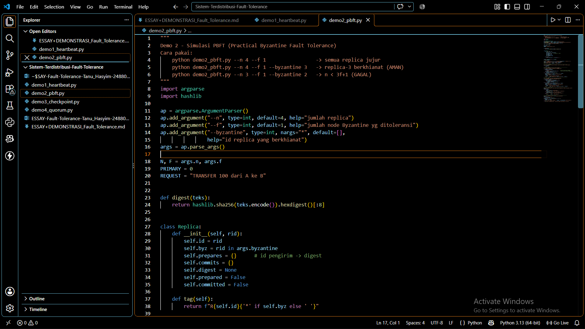

<p align="center"><em>Gambar 5. Cuplikan berkas <code>demo2_pbft.py</code> di editor.</em></p>

- **Skenario A** (semua replica jujur): jalankan `python demo2_pbft.py --n 4 --f 1`. Amati bahwa setiap replica mencapai status *prepared* dan *committed*.

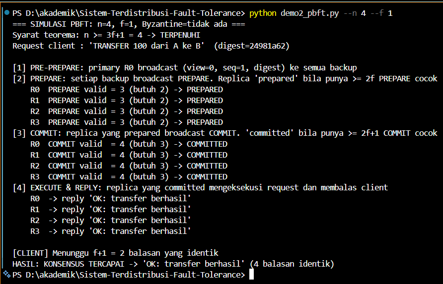

<p align="center"><em>Gambar 6. Skenario A: n=4, f=1, tanpa replica Byzantine. Konsensus tercapai (4 balasan identik).</em></p>

- **Skenario B** (satu replica berkhianat, n = 3f+1): jalankan `python demo2_pbft.py --n 4 --f 1 --byzantine 3`. Replica bertanda `*` adalah replica Byzantine. Amati bahwa tiga replica jujur tetap mencapai *committed* dan client menerima jawaban yang benar.

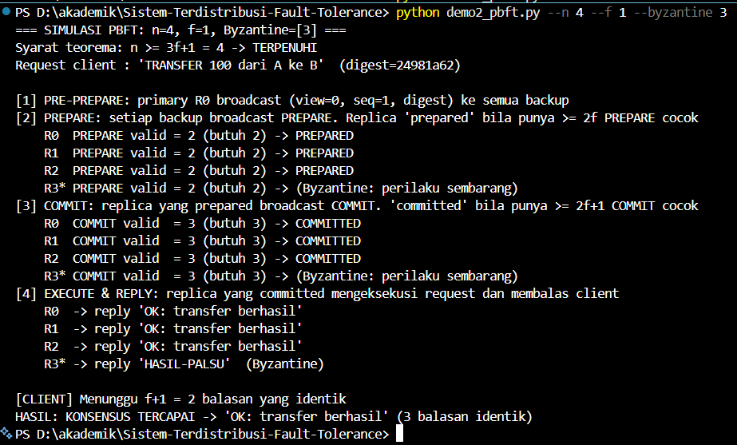

<p align="center"><em>Gambar 7. Skenario B: n=4, f=1, R3 Byzantine. Konsensus tetap tercapai (3 balasan identik).</em></p>

- **Skenario C** (n < 3f+1): jalankan `python demo2_pbft.py --n 3 --f 1 --byzantine 2`. Amati bahwa jumlah PREPARE valid hanya 1 (butuh 2) sehingga protokol berhenti dan konsensus gagal.

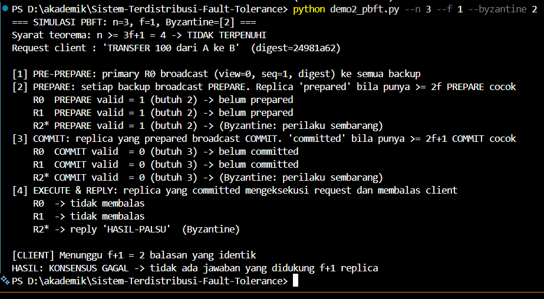

<p align="center"><em>Gambar 8. Skenario C: n=3, f=1, R2 Byzantine. Syarat 3f+1 tidak terpenuhi, konsensus gagal.</em></p>

| **Skenario** | **n** | **f** | **Byzantine** | **n ≥ 3f+1** | **Hasil** |
| --- | --- | --- | --- | --- | --- |
| A | 4 | 1 | tidak ada | Terpenuhi | Konsensus tercapai, 4 balasan identik |
| B | 4 | 1 | R3 | Terpenuhi | Konsensus tercapai, 3 balasan identik; balasan palsu R3 diabaikan |
| C | 3 | 1 | R2 | Tidak terpenuhi | Konsensus gagal; tidak ada jawaban yang didukung f+1 replica |

Pada skenario B, setiap replica jujur melihat tepat 2 PREPARE valid (batas 2f = 2) dan 3 COMMIT valid (batas 2f+1 = 3). Artinya tidak ada kelonggaran lagi: dengan 4 replica, sistem hanya mampu menoleransi 1 replica Byzantine. Pada skenario C hanya tersisa 1 PREPARE valid, sehingga tidak ada replica yang mencapai status *prepared* dan sistem berhenti (kehilangan *liveness*) walaupun tidak ada jawaban salah yang diterima client. Hasil ini memperagakan teorema pada slide, yaitu minimal 3f+1 node untuk menoleransi f node Byzantine.

Keterbatasan simulasi: replica dijalankan dalam satu proses secara sinkron, *primary* diasumsikan jujur, belum ada *view change* maupun kriptografi, sehingga simulasi ini hanya memperagakan aritmetika *quorum* dan bukan implementasi PBFT lengkap.

### 2.9 Kode Program

```python
"""
Demo 2 - Simulasi PBFT (Practical Byzantine Fault Tolerance)
Cara pakai:
    python demo2_pbft.py --n 4 --f 1                 -> semua replica jujur
    python demo2_pbft.py --n 4 --f 1 --byzantine 3   -> replica-3 berkhianat (AMAN)
    python demo2_pbft.py --n 3 --f 1 --byzantine 2   -> n < 3f+1 (GAGAL)
"""

import argparse
import hashlib

ap = argparse.ArgumentParser()
ap.add_argument("--n", type=int, default=4, help="jumlah replica")
ap.add_argument("--f", type=int, default=1, help="jumlah node Byzantine yg ditoleransi")
ap.add_argument("--byzantine", type=int, nargs="*", default=[],
                help="id replica yang berkhianat")

args = ap.parse_args()
N, F = args.n, args.f
PRIMARY = 0
REQUEST = "TRANSFER 100 dari A ke B"

def digest(teks):
    return hashlib.sha256(teks.encode()).hexdigest()[:8]

class Replica:
    def __init__(self, rid):
        self.id = rid
        self.byz = rid in args.byzantine
        self.prepares = {}      # id pengirim -> digest
        self.commits = {}
        self.digest = None
        self.prepared = False
        self.committed = False

    def tag(self):
        return f"R{self.id}{'*' if self.byz else ' '}"

replicas = [Replica(i) for i in range(N)]
d = digest(REQUEST)
print(f"=== SIMULASI PBFT: n={N}, f={F}, Byzantine={args.byzantine or 'tidak ada'} ===")
syarat = "TERPENUHI" if N >= 3 * F + 1 else "TIDAK TERPENUHI"
print(f"Syarat teorema: n >= 3f+1 = {3*F+1} -> {syarat}")
print(f"Request client : '{REQUEST}'  (digest={d})\n")

# --- Fase 1: PRE-PREPARE ---------------------------------------------------
print("[1] PRE-PREPARE: primary R0 broadcast (view=0, seq=1, digest) ke semua backup")
for r in replicas:
    r.digest = d

# --- Fase 2: PREPARE -------------------------------------------------------
print("[2] PREPARE: setiap backup broadcast PREPARE. "
      "Replica 'prepared' bila punya >= 2f PREPARE cocok")

for pengirim in replicas:
    if pengirim.id == PRIMARY:
        continue                                      # primary tidak mengirim PREPARE
    isi = digest("PALSU") if pengirim.byz else d     # replica Byzantine mengirim digest palsu
    for penerima in replicas:
        penerima.prepares[pengirim.id] = isi

for r in replicas:
    valid = sum(1 for v in r.prepares.values() if v == r.digest)
    r.prepared = valid >= 2 * F
    status = "PREPARED" if r.prepared else "belum prepared"
    if r.byz:
        status = "(Byzantine: perilaku sembarang)"
    print(f"    {r.tag()} PREPARE valid = {valid} (butuh {2*F}) -> {status}")

# --- Fase 3: COMMIT --------------------------------------------------------
print("[3] COMMIT: replica yang prepared broadcast COMMIT. "
      "'committed' bila punya >= 2f+1 COMMIT cocok")

for pengirim in replicas:
    if pengirim.prepared or pengirim.byz:
        isi = digest("PALSU") if pengirim.byz else d
        for penerima in replicas:
            penerima.commits[pengirim.id] = isi

for r in replicas:
    valid = sum(1 for v in r.commits.values() if v == r.digest)
    r.committed = r.prepared and valid >= 2 * F + 1
    status = "COMMITTED" if r.committed else "belum committed"
    if r.byz:
        status = "(Byzantine: perilaku sembarang)"
    print(f"    {r.tag()} COMMIT valid  = {valid} (butuh {2*F+1}) -> {status}")

# --- Fase 4: EXECUTE & REPLY ----------------------------------------------
print("[4] EXECUTE & REPLY: replica yang committed mengeksekusi request dan membalas client")
balasan = []
for r in replicas:
    if r.byz:
        balasan.append((r.id, "HASIL-PALSU"))
        print(f"    {r.tag()} -> reply 'HASIL-PALSU'  (Byzantine)")
    elif r.committed:
        balasan.append((r.id, "OK: transfer berhasil"))
        print(f"    {r.tag()} -> reply 'OK: transfer berhasil'")
    else:
        print(f"    {r.tag()} -> tidak membalas")

# --- Client menunggu f+1 balasan identik ---------------------------------
print(f"\n[CLIENT] Menunggu f+1 = {F+1} balasan yang identik")
hitung = {}
for _, h in balasan:
    hitung[h] = hitung.get(h, 0) + 1

diterima = [h for h, c in hitung.items() if c >= F + 1]
if diterima:
    jawaban = diterima[0]
    print(f"HASIL: KONSENSUS TERCAPAI -> '{jawaban}' ({hitung[jawaban]} balasan identik)")

else:
    print("HASIL: KONSENSUS GAGAL -> tidak ada jawaban yang didukung f+1 replica")
```

## 3. Desain Checkpointing Strategy untuk Aplikasi Pilihan

### 3.1 Aplikasi yang Dipilih

Aplikasi yang dipilih adalah sistem e-commerce dengan lima service yang saling berkomunikasi intensif, sesuai *Ice Breaker #3* pada materi: *user auth*, *inventory*, *payment*, *shipping*, dan *notification*. Satu pesanan diproses secara berantai: pengguna terautentikasi, stok dikurangi (*inventory*), pembayaran dicatat (*payment*), paket dibuat (*shipping*), lalu notifikasi dikirim (*notification*). Karena setiap langkah mengubah state di service yang berbeda, kegagalan di tengah rantai dapat meninggalkan state global yang tidak konsisten, misalnya stok sudah berkurang tetapi pembayaran belum tercatat.

### 3.2 Analisis Kekritisan Service

| **Service** | **State yang harus diselamatkan** | **Dampak bila hilang** | **Kritis** | **Perlakuan checkpoint** |
| --- | --- | --- | --- | --- |
| Payment | Transaksi dan status pembayaran | Kerugian finansial, tagihan ganda, sengketa | Sangat tinggi | Checkpoint terkoordinasi + *write-ahead log* sinkron, *idempotency key* |
| Inventory | Stok dan reservasi barang | *Overselling* atau stok fiktif | Tinggi | Checkpoint terkoordinasi + *log* reservasi |
| Shipping | Status pengiriman dan nomor resi | Pesanan terbayar tetapi tidak terkirim | Sedang-tinggi | Checkpoint terkoordinasi periodik |
| User Auth | Akun dan sesi/token | Pengguna harus login ulang | Sedang | Data akun sudah di database ter-replikasi; sesi cukup checkpoint ringan |
| Notification | Antrean notifikasi | Notifikasi terlambat atau terduplikasi | Rendah | Tanpa checkpoint khusus; kirim ulang (*at-least-once*) dengan deduplikasi |

Jadi, service yang paling kritis untuk di-*checkpoint* adalah **payment** dan **inventory**, karena keduanya menyimpan state bernilai uang dan menentukan kebenaran pesanan. *Notification* paling kurang kritis karena efeknya dapat diulang tanpa merusak data.

### 3.3 Waktu Optimal Melakukan Checkpoint

- **Periodik di titik tenang (quiescent).** Checkpoint dilakukan di antara dua batch pesanan atau saat trafik rendah, ketika tidak ada pesan *in-flight* antar-service, sehingga *global state* yang tersimpan konsisten.

- **Berbasis kejadian.** Setelah transaksi bernilai tinggi berhasil (misalnya pembayaran sukses), peristiwa dicatat ke *log* sehingga pekerjaan di antara dua *checkpoint* dapat diputar ulang (*checkpoint + message logging*).

- **Interval.** Interval optimal dapat didekati dengan rumus Young: T ≈ √(2·C·MTBF), dengan C biaya satu *checkpoint* dan MTBF rata-rata waktu antar kegagalan. Sebagai contoh dengan asumsi ilustratif C = 2 detik dan MTBF = 6 jam (21.600 detik), T ≈ √86.400 ≈ 294 detik, atau sekitar 5 menit.

### 3.4 Koordinasi antar Service

Strategi yang dipilih adalah *coordinated checkpointing* dengan sebuah koordinator (misalnya *order orchestrator*) yang menjalankan protokol dua tahap: (1) koordinator mengirim *checkpoint request*, setiap service berhenti menerima pesanan baru dan menuntaskan pesan yang sedang berjalan; (2) setiap service menyimpan *snapshot* lokal dan membalas ACK; (3) setelah semua ACK diterima, koordinator mengumumkan *commit* dan layanan dilanjutkan. Sebuah *checkpoint* dianggap sah hanya bila seluruh service berhasil menyimpannya. Alternatif tanpa menghentikan layanan adalah algoritma *snapshot* berbasis penanda (Chandy dan Lamport, 1985). Ketika terjadi kegagalan, seluruh service di-*rollback* ke *checkpoint* terakhir yang sah (*recovery line*) lalu pesanan sesudahnya diputar ulang.

Satu hal yang tidak dapat diselesaikan oleh *rollback* saja adalah efek ke dunia luar, seperti penarikan dana kartu atau pengiriman email, yang tidak bisa ditarik kembali (*output commit problem*, Elnozahy dkk., 2002). Untuk itu *backward recovery* dikombinasikan dengan *forward recovery*: operasi diberi *idempotency key* agar pemutaran ulang tidak menagih dua kali, dan langkah yang sudah terlanjur terjadi dibatalkan dengan *compensating transaction* (pola *Saga*).

### 3.5 Perbandingan Pendekatan Checkpointing

| **Aspek** | **Independent** | **Coordinated** | **Communication-induced** |
| --- | --- | --- | --- |
| Koordinasi | Tidak ada | Sinkronisasi global | Dipicu event komunikasi |
| Overhead saat normal | Rendah | Sedang (ada jeda sinkronisasi) | Sedang, bervariasi |
| Risiko *domino effect* | Tinggi | Tidak ada | Rendah |
| Kemudahan *recovery* | Sulit, harus mencari *recovery line* | Mudah, cukup checkpoint terakhir | Sedang |
| Kesesuaian untuk e-commerce | Kurang (state uang rawan inkonsisten) | Dipilih | Alternatif bila jeda tidak boleh |

### 3.6 Trade-off yang Dipertimbangkan

- **Frekuensi vs overhead.** Checkpoint yang sering memperkecil pekerjaan yang hilang tetapi menambah beban I/O dan jeda; checkpoint jarang sebaliknya.

- **Konsistensi vs ketersediaan.** Koordinasi memerlukan jeda singkat pada pesanan baru; jeda ini harus dijaga sependek mungkin.

- **RPO vs RTO.** Menambah *log* mengecilkan kehilangan data (RPO) tetapi dapat memperpanjang waktu pemulihan (RTO) karena ada pemutaran ulang.

- **Biaya penyimpanan dan kompleksitas.** Checkpoint perlu penyimpanan tahan lama dan penghapusan versi lama; kompleksitas koordinasi bertambah seiring jumlah service.

### 3.7 Demonstrasi Checkpointing dan Rollback

Program mensimulasikan 10 pesanan. *Checkpoint* terkoordinasi disimpan setelah pesanan ke-3, 6, dan 9. Pada pesanan ke-8 service payment *crash* setelah stok berkurang tetapi sebelum pembayaran dicatat. Dua strategi pemulihan dibandingkan: **koordinasi** (seluruh service di-*rollback* ke *checkpoint* terakhir lalu pesanan diputar ulang) dan **naif** (hanya service yang *crash* yang dipulihkan, service lain dibiarkan lanjut).

- Buat berkas `demo3_checkpoint.py` lalu salin kode pada bagian 3.8.

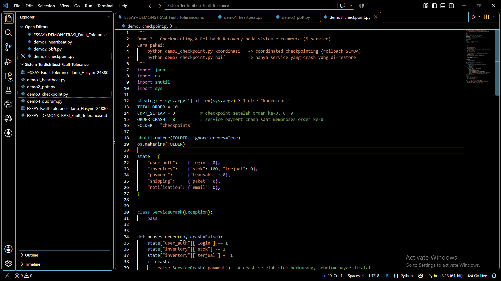

<p align="center"><em>Gambar 9. Cuplikan berkas <code>demo3_checkpoint.py</code> di editor.</em></p>

- Jalankan strategi terkoordinasi: `python demo3_checkpoint.py koordinasi`, lalu lihat berkas *checkpoint* yang tersimpan dengan `ls checkpoints` (Windows: `dir checkpoints`).

- Amati: *checkpoint* tersimpan pada pesanan 3, 6, dan 9; setelah *crash* pada pesanan 8, seluruh service di-*rollback* ke `ckpt_6.json`, pesanan 7 sampai 10 diputar ulang, dan validasi akhir menyatakan state konsisten.

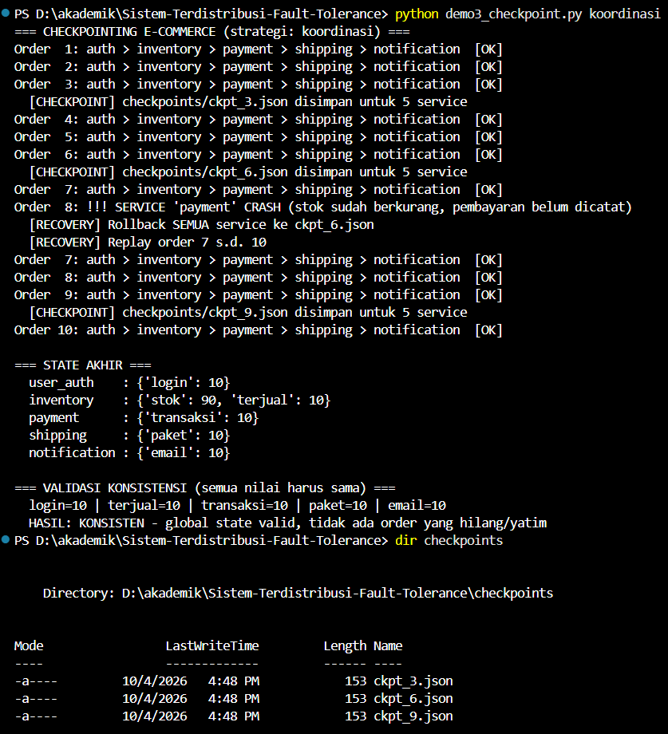

<p align="center"><em>Gambar 10. Strategi koordinasi: rollback semua service ke <code>ckpt_6.json</code>, hasil akhir konsisten.</em></p>

- Jalankan strategi naif: `python demo3_checkpoint.py naif`.

- Amati: hanya payment yang dipulihkan ke `ckpt_6.json` sehingga jumlah transaksi pembayaran tertinggal dari jumlah barang terjual dan paket yang dikirim.

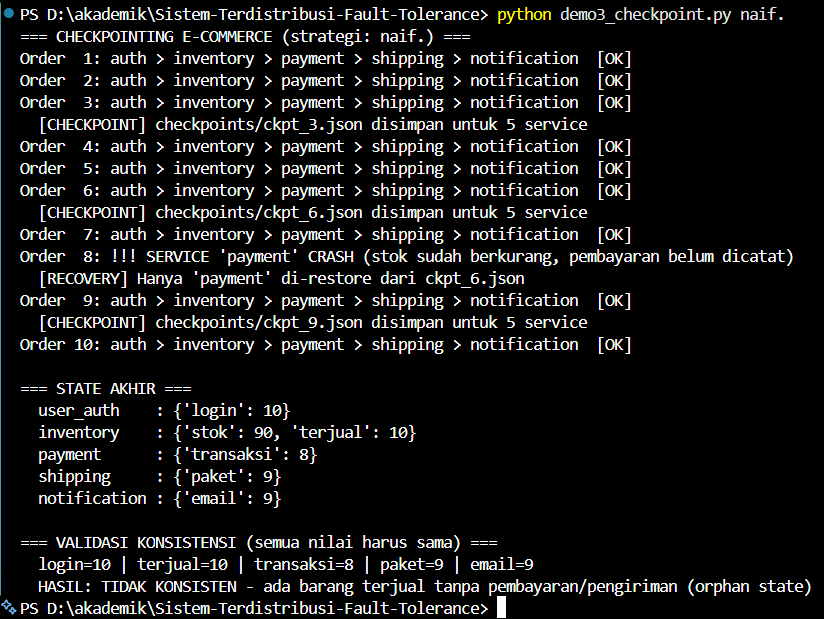

<p align="center"><em>Gambar 11. Strategi naif: state akhir tidak konsisten (terdapat barang terjual tanpa pembayaran).</em></p>

| **Strategi** | **login** | **terjual** | **transaksi** | **paket** | **email** | **Hasil validasi** |
| --- | --- | --- | --- | --- | --- | --- |
| Koordinasi | 10 | 10 | 10 | 10 | 10 | Konsisten |
| Naif | 10 | 10 | 8 | 9 | 9 | Tidak konsisten (*orphan state*) |

Pada strategi koordinasi, semua service kembali ke titik yang sama sehingga jumlah pesanan di tiap service identik (10). Pada strategi naif, payment mundur ke pesanan 6 sementara inventory terus maju: dua pesanan (7 dan 8) berstatus barang terjual tetapi pembayarannya tidak tercatat, dan paket serta notifikasi untuk pesanan 8 tidak pernah dibuat. Inilah akibat state global yang tidak konsisten. Demonstrasi ini menegaskan alasan *recovery line* harus berupa kumpulan *checkpoint* yang membentuk *consistent global state*.

Catatan: pada pendekatan *independent checkpointing* yang sesungguhnya, ketidakkonsistenan seperti ini dapat memicu *domino effect* (rollback berantai hingga state awal). Simulasi di atas lebih sederhana dan hanya menggambarkan akibat tidak adanya koordinasi saat pemulihan.

### 3.8 Kode Program

```python
"""
Demo 3 - Checkpointing & Rollback Recovery pada sistem e-commerce (5 service)
Cara pakai:
    python demo3_checkpoint.py koordinasi   -> coordinated checkpointing (rollback SEMUA)
    python demo3_checkpoint.py naif         -> hanya service yang crash yang di-restore
"""

import json
import os
import shutil
import sys

strategi = sys.argv[1] if len(sys.argv) > 1 else "koordinasi"
TOTAL_ORDER = 10
CKPT_SETIAP = 3          # checkpoint setelah order ke-3, 6, 9
ORDER_CRASH = 8          # service payment crash saat memproses order ke-8
FOLDER = "checkpoints"
shutil.rmtree(FOLDER, ignore_errors=True)
os.makedirs(FOLDER)
state = {
    "user_auth":    {"login": 0},
    "inventory":    {"stok": 100, "terjual": 0},
    "payment":      {"transaksi": 0},
    "shipping":     {"paket": 0},
    "notification": {"email": 0},
}

class ServiceCrash(Exception):
    pass

def proses_order(no, crash=False):
    state["user_auth"]["login"] += 1
    state["inventory"]["stok"] -= 1
    state["inventory"]["terjual"] += 1
    if crash:
        raise ServiceCrash("payment")   # crash setelah stok berkurang, sebelum bayar dicatat
    state["payment"]["transaksi"] += 1
    state["shipping"]["paket"] += 1
    state["notification"]["email"] += 1

def simpan_checkpoint(no):
    """Checkpoint dilakukan di antara dua order (tidak ada pesan 'dalam perjalanan')."""
    path = f"{FOLDER}/ckpt_{no}.json"
    with open(path, "w") as f:
        json.dump(state, f)
    print(f"  [CHECKPOINT] {path} disimpan untuk {len(state)} service")

def muat_checkpoint(no):
    with open(f"{FOLDER}/ckpt_{no}.json") as f:
        return json.load(f)

def cetak_state():
    for svc, isi in state.items():
        print(f"  {svc:<13}: {isi}")

print(f"=== CHECKPOINTING E-COMMERCE (strategi: {strategi}) ===")
order, ckpt_terakhir, sudah_crash = 1, 0, False
while order <= TOTAL_ORDER:
    try:
        proses_order(order, crash=(order == ORDER_CRASH and not sudah_crash))
        print(f"Order {order:>2}: auth > inventory > payment > shipping > notification  [OK]")
        if order % CKPT_SETIAP == 0:
            simpan_checkpoint(order)
            ckpt_terakhir = order
        order += 1
    except ServiceCrash as e:
        sudah_crash = True
        print(f"Order {order:>2}: !!! SERVICE '{e}' CRASH "
              "(stok sudah berkurang, pembayaran belum dicatat)")
        if strategi == "koordinasi":
            print(f"  [RECOVERY] Rollback SEMUA service ke ckpt_{ckpt_terakhir}.json")
            state = muat_checkpoint(ckpt_terakhir)
            order = ckpt_terakhir + 1
            print(f"  [RECOVERY] Replay order {order} s.d. {TOTAL_ORDER}")
        else:
            print(f"  [RECOVERY] Hanya 'payment' di-restore dari ckpt_{ckpt_terakhir}.json")
            state["payment"] = muat_checkpoint(ckpt_terakhir)["payment"]
            order += 1                      # service lain lanjut tanpa rollback

print("\n=== STATE AKHIR ===")
cetak_state()
nilai = {
    "login": state["user_auth"]["login"],
    "terjual": state["inventory"]["terjual"],
    "transaksi": state["payment"]["transaksi"],
    "paket": state["shipping"]["paket"],
    "email": state["notification"]["email"],
}

print("\n=== VALIDASI KONSISTENSI (semua nilai harus sama) ===")
print("  " + " | ".join(f"{k}={v}" for k, v in nilai.items()))
if len(set(nilai.values())) == 1:
    print("  HASIL: KONSISTEN - global state valid, tidak ada order yang hilang/yatim")

else:
    print("  HASIL: TIDAK KONSISTEN - ada barang terjual tanpa "
          "pembayaran/pengiriman (orphan state)")
```

## 4. Review Kasus Studi Sistem Fault Tolerant di Industri

### 4.1 Pendahuluan

Bagian ini mengulas tiga sistem industri yang disebut pada materi, yaitu Google Spanner, Amazon DynamoDB (beserta pendahulunya, Dynamo), dan Apache Kafka. Ketiganya sama-sama bertumpu pada *replication*, tetapi memilih titik kompromi yang berbeda antara konsistensi dan ketersediaan.

### 4.2 Google Spanner

Spanner adalah basis data yang terdistribusi secara global (Corbett dkk., 2012). Data dibagi menjadi beberapa *split*, dan setiap *split* direplikasi pada beberapa zona dengan protokol konsensus *Paxos* yang memiliki *leader* berumur panjang melalui *lease*. Kegagalan satu replica atau satu zona ditangani dengan memilih *leader* baru selama mayoritas replica masih hidup. Transaksi lintas *split* memakai *two-phase commit* di atas grup Paxos. Inovasi utamanya adalah API *TrueTime* yang mengekspos ketidakpastian jam (berbasis GPS dan jam atom) sehingga Spanner dapat memberikan *external consistency* dengan menunggu hingga ketidakpastian itu lewat (*commit wait*). Dalam kerangka CAP, Spanner memilih konsistensi.

### 4.3 Amazon Dynamo dan DynamoDB

Dynamo (DeCandia dkk., 2007) adalah *key-value store* yang memprioritaskan ketersediaan. Data didistribusikan dengan *consistent hashing* dan direplikasi ke N node; tulis dan baca memakai *quorum* W dan R yang dapat diatur. Kegagalan sementara ditangani dengan *sloppy quorum* dan *hinted handoff* (node lain menampung tulisan sementara untuk node yang mati), konflik versi dideteksi dengan *vector clock*, dan replica yang tidak sinkron diperbaiki dengan *anti-entropy* memakai *Merkle tree* serta *read repair*. Keanggotaan dan deteksi kegagalan dilakukan lewat protokol *gossip*. Hasilnya adalah sistem yang tetap menerima tulisan saat ada kegagalan, dengan konsekuensi konsistensi akhir (*eventual consistency*).

Perlu dicatat bahwa layanan *Amazon DynamoDB* yang diluncurkan pada 2012 hanya berbagi nama dengan Dynamo dan memiliki arsitektur yang banyak berbeda. Menurut paper USENIX ATC 2022 (Elhemali dkk.), replica pada setiap partisi membentuk *replication group* yang memakai *Multi-Paxos* untuk pemilihan *leader* dan konsensus. Jadi, penggunaan *vector clock* dan *hinted handoff* lebih tepat dikaitkan dengan paper Dynamo, bukan layanan DynamoDB yang beroperasi saat ini.

### 4.4 Apache Kafka

Kafka mereplikasi setiap partisi dengan model *leader-follower*. Seluruh tulis dan baca melalui *leader*, sedangkan *follower* menyalin *log*-nya. Himpunan replica yang masih mengikuti *leader* disebut *in-sync replicas* (ISR); *follower* yang tertinggal terlalu jauh dikeluarkan dari ISR. Dengan konfigurasi `acks=all` dan `min.insync.replicas`, sebuah tulisan baru dianggap berhasil setelah diterima oleh sejumlah minimum replica dalam ISR, sehingga ketika *leader* gagal, *leader* baru dipilih dari ISR tanpa kehilangan data yang sudah dikonfirmasi. Koordinasi klaster (pemilihan *leader* partisi dan metadata) ditangani oleh *controller*. Pada materi disebutkan ZooKeeper sebagai penyimpan metadata; pada Apache Kafka 4.0 (dirilis 18 Maret 2025) ZooKeeper sudah dihapus dan digantikan oleh KRaft, yaitu konsensus berbasis Raft yang tertanam di dalam Kafka.

### 4.5 Perbandingan

| **Aspek** | **Google Spanner** | **Amazon Dynamo (paper)** | **Apache Kafka** |
| --- | --- | --- | --- |
| Model kegagalan | *Crash* dan partisi jaringan | *Crash*, partisi, node lambat | *Crash* broker |
| Replikasi | Paxos per *split*, *leader* berbasis *lease* | *Quorum* N, R, W; *sloppy quorum* | *Leader-follower* dengan ISR |
| Penanganan sementara | Pemilihan *leader* baru | *Hinted handoff* | Keluarkan *follower* lambat dari ISR |
| Perbaikan data basi | Replikasi *log* Paxos | *Read repair*, *Merkle tree* | *Follower* mengejar *log leader* |
| Konsistensi | Kuat (*external consistency*) | Akhir (*eventual*) | Dapat diatur lewat acks, `min.insync.replicas` |
| Trade-off utama | Latensi tulis lebih tinggi dan perlu infrastruktur jam khusus | Konflik versi harus diselesaikan | Tulis ditolak bila ISR di bawah batas minimum |

### 4.6 Catatan Kritis

Pada slide materi, Spanner disebut mengatasi perilaku *byzantine-like* lewat TrueTime. Menurut paper Spanner, TrueTime menangani ketidakpastian jam untuk mencapai *external consistency*, sedangkan model kegagalan Spanner (dan Paxos) adalah *crash* serta partisi jaringan, bukan kegagalan *Byzantine*. Ketiga sistem di atas pada dasarnya tidak toleran terhadap node berbahaya; untuk itu diperlukan protokol seperti PBFT pada bagian 2. Pelajaran umumnya adalah bahwa pemilihan strategi harus mengikuti *threat model*: *replication* dan konsensus *crash-fault* sudah cukup untuk pusat data tepercaya, sedangkan BFT hanya perlu dipakai bila ada pihak yang tidak saling percaya.

### 4.7 Demonstrasi Replikasi Quorum

Demonstrasi ini menirukan prinsip *quorum* gaya Dynamo dengan N=3, W=2, dan R=2: tulis dianggap berhasil bila minimal 2 dari 3 replica menerima, dan baca mengambil versi terbaru dari 2 replica serta memperbaiki replica yang basi (*read repair*). Konsep *quorum* yang sama muncul pada Kafka dalam bentuk `min.insync.replicas` dan pada Spanner dalam bentuk mayoritas Paxos.

- Buat berkas `demo4_quorum.py` lalu salin kode pada bagian 4.8.

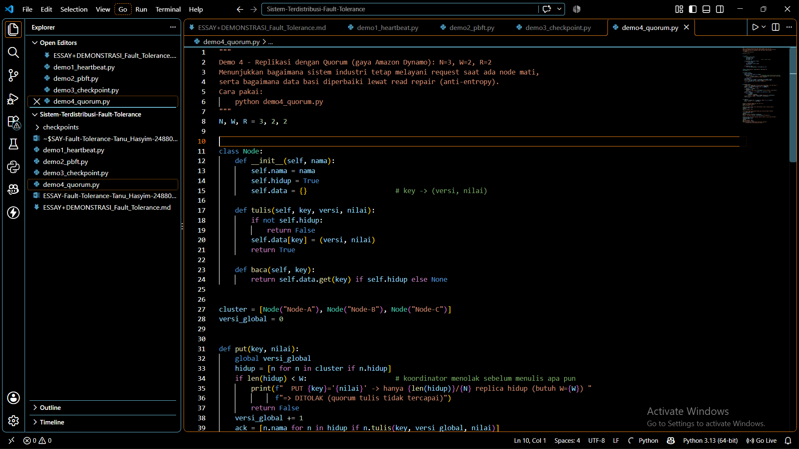

<p align="center"><em>Gambar 12. Cuplikan berkas <code>demo4_quorum.py</code> di editor.</em></p>

- Jalankan `python demo4_quorum.py` lalu amati empat tahap: (1) kondisi normal, (2) Node-C mati tetapi tulis tetap berhasil, (3) Node-C pulih dengan data basi dan diperbaiki oleh *read repair*, (4) dua node mati sehingga tulis ditolak dan baca gagal.

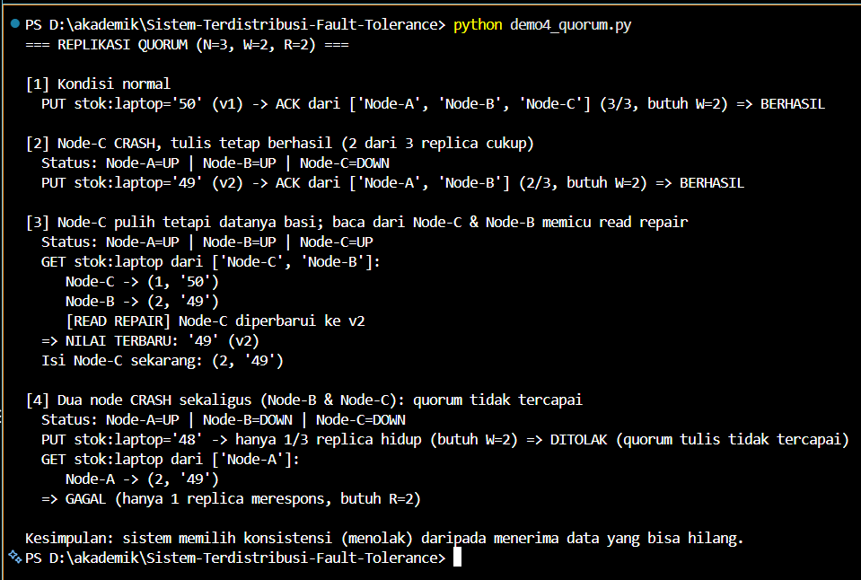

<p align="center"><em>Gambar 13. Keluaran demo quorum: tulis tetap berhasil saat 1 node mati, ditolak saat 2 node mati.</em></p>

Pada tahap 2, tulis versi 2 tetap berhasil karena 2 dari 3 replica sudah memenuhi W=2, sehingga satu kegagalan node tidak mengganggu layanan. Pada tahap 3, Node-C masih menyimpan versi 1 (basi); ketika dibaca bersama Node-B, koordinator memilih versi 2 yang lebih baru lalu memperbaiki Node-C. Pada tahap 4, hanya satu replica yang hidup sehingga W=2 dan R=2 tidak terpenuhi: sistem menolak menulis dan membaca daripada memberikan data yang mungkin salah. Ini adalah contoh nyata kompromi antara konsistensi dan ketersediaan.

Keterbatasan simulasi: belum ada *hinted handoff*, *vector clock*, *Merkle tree*, maupun partisi jaringan; nomor versi bersifat global sebagai penyederhanaan.

### 4.8 Kode Program

```python
"""
Demo 4 - Replikasi dengan Quorum (gaya Amazon Dynamo): N=3, W=2, R=2
Menunjukkan bagaimana sistem industri tetap melayani request saat ada node mati,
serta bagaimana data basi diperbaiki lewat read repair (anti-entropy).
Cara pakai:
    python demo4_quorum.py
"""

N, W, R = 3, 2, 2

class Node:
    def __init__(self, nama):
        self.nama = nama
        self.hidup = True
        self.data = {}                      # key -> (versi, nilai)

    def tulis(self, key, versi, nilai):
        if not self.hidup:
            return False
        self.data[key] = (versi, nilai)
        return True

    def baca(self, key):
        return self.data.get(key) if self.hidup else None

cluster = [Node("Node-A"), Node("Node-B"), Node("Node-C")]
versi_global = 0

def put(key, nilai):
    global versi_global
    hidup = [n for n in cluster if n.hidup]
    if len(hidup) < W:                      # koordinator menolak sebelum menulis apa pun
        print(f"  PUT {key}='{nilai}' -> hanya {len(hidup)}/{N} replica hidup (butuh W={W}) "
              f"=> DITOLAK (quorum tulis tidak tercapai)")
        return False
    versi_global += 1
    ack = [n.nama for n in hidup if n.tulis(key, versi_global, nilai)]
    print(f"  PUT {key}='{nilai}' (v{versi_global}) -> ACK dari {ack} "
          f"({len(ack)}/{N}, butuh W={W}) => BERHASIL")
    return True

def get(key, dari):
    """Koordinator membaca dari R replica, ambil versi terbaru, lalu read repair."""
    jawaban = [(n, n.baca(key)) for n in dari if n.hidup][:R]
    print(f"  GET {key} dari {[n.nama for n, _ in jawaban]}:")
    for n, v in jawaban:
        print(f"     {n.nama} -> {v}")
    if len(jawaban) < R:
        print(f"  => GAGAL (hanya {len(jawaban)} replica merespons, butuh R={R})")
        return None
    terbaru = max((v for _, v in jawaban if v), key=lambda x: x[0])
    for n, v in jawaban:
        if v != terbaru:
            n.tulis(key, *terbaru)
            print(f"     [READ REPAIR] {n.nama} diperbarui ke v{terbaru[0]}")
    print(f"  => NILAI TERBARU: '{terbaru[1]}' (v{terbaru[0]})")
    return terbaru

def status():
    teks = [f"{n.nama}={'UP' if n.hidup else 'DOWN'}" for n in cluster]
    print("  Status: " + " | ".join(teks))

print("=== REPLIKASI QUORUM (N=3, W=2, R=2) ===")
print("\n[1] Kondisi normal")
put("stok:laptop", "50")
print("\n[2] Node-C CRASH, tulis tetap berhasil (2 dari 3 replica cukup)")
cluster[2].hidup = False
status()
put("stok:laptop", "49")
print("\n[3] Node-C pulih tetapi datanya basi; baca dari Node-C & Node-B "
      "memicu read repair")

cluster[2].hidup = True
status()
get("stok:laptop", [cluster[2], cluster[1]])
print(f"  Isi Node-C sekarang: {cluster[2].data['stok:laptop']}")
print("\n[4] Dua node CRASH sekaligus (Node-B & Node-C): quorum tidak tercapai")
cluster[1].hidup = False
cluster[2].hidup = False
status()
put("stok:laptop", "48")
get("stok:laptop", cluster)
print("\nKesimpulan: sistem memilih konsistensi (menolak) "
      "daripada menerima data yang bisa hilang.")
```

## Kesimpulan

Empat tugas pada esai ini menunjukkan bahwa fault tolerance merupakan rangkaian keputusan, bukan satu teknik tunggal. Deteksi kegagalan dengan *heartbeat* memperlihatkan bahwa *timeout* selalu menukar kecepatan deteksi dengan akurasi. PBFT memperlihatkan harga toleransi terhadap node berbahaya, yaitu minimal 3f+1 replica dan komunikasi yang mahal. Desain *checkpointing* menunjukkan bahwa pemulihan hanya benar bila *recovery line* membentuk *consistent global state*, dan bahwa *rollback* perlu dilengkapi *idempotency* untuk efek ke luar sistem. Studi kasus industri menegaskan bahwa Spanner, Dynamo, dan Kafka memilih kompromi konsistensi-ketersediaan yang berbeda sesuai kebutuhannya.

Sejalan dengan kesimpulan materi, tidak ada solusi universal. Pilihan strategi bergantung pada *threat model*, kebutuhan kinerja, dan kemampuan menanggung kompleksitas implementasi. Seluruh demonstrasi Python dalam esai ini sengaja disederhanakan agar prinsipnya mudah diamati dan dapat dijalankan ulang oleh pembaca.

## Daftar Pustaka

Castro, M., & Liskov, B. (1999). Practical Byzantine fault tolerance. *Proceedings of the 3rd Symposium on Operating Systems Design and Implementation (OSDI ’99)*. USENIX Association.

Chandra, T. D., & Toueg, S. (1996). Unreliable failure detectors for reliable distributed systems. *Journal of the ACM, 43*(2), 225–267.

Chandy, K. M., & Lamport, L. (1985). Distributed snapshots: Determining global states of distributed systems. *ACM Transactions on Computer Systems, 3*(1), 63–75.

Corbett, J. C., dkk. (2012). Spanner: Google’s globally-distributed database. *Proceedings of the 10th USENIX Symposium on Operating Systems Design and Implementation (OSDI ’12)*.

Das, A., Gupta, I., & Motivala, A. (2002). SWIM: Scalable weakly-consistent infection-style process group membership protocol. *Proceedings of the International Conference on Dependable Systems and Networks (DSN 2002)*.

DeCandia, G., dkk. (2007). Dynamo: Amazon’s highly available key-value store. *Proceedings of the 21st ACM Symposium on Operating Systems Principles (SOSP ’07)*, 205–220.

Elhemali, M., dkk. (2022). Amazon DynamoDB: A scalable, predictably performant, and fully managed NoSQL database service. *2022 USENIX Annual Technical Conference (USENIX ATC ’22)*.

Elnozahy, E. N., Alvisi, L., Wang, Y.-M., & Johnson, D. B. (2002). A survey of rollback-recovery protocols in message-passing systems. *ACM Computing Surveys, 34*(3), 375–408.

Hayashibara, N., Défago, X., Yared, R., & Katayama, T. (2004). The φ accrual failure detector. *Proceedings of the 23rd IEEE International Symposium on Reliable Distributed Systems (SRDS 2004)*.

Lamport, L., Shostak, R., & Pease, M. (1982). The Byzantine generals problem. *ACM Transactions on Programming Languages and Systems, 4*(3), 382–401.

Yin, M., Malkhi, D., Reiter, M. K., Gueta, G. G., & Abraham, I. (2019). HotStuff: BFT consensus with linearity and responsiveness. *Proceedings of the 2019 ACM Symposium on Principles of Distributed Computing (PODC ’19)*.

Young, J. W. (1974). A first order approximation to the optimum checkpoint interval. *Communications of the ACM, 17*(9), 530–531.

Apache Software Foundation. (2025). *Apache Kafka 4.0 release notes and upgrade guide*. https://kafka.apache.org

Dewantara, R. *Fault Tolerance dalam Sistem Terdistribusi: Membangun Sistem yang Tahan Terhadap Kegagalan* [Slide perkuliahan Sistem Terdistribusi].